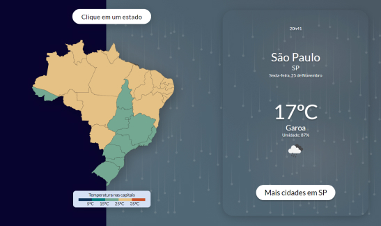

<a name="readme-top"></a>

<div align="center">
  <a href="https://github.com/vitorfontenele/weather-app-brasil">
    
  </a>
  <h3 align="center">weather-app-brasil</h3>
  <a href="https://vitorfontenele.github.io/weather-app-brasil-build/">https://vitorfontenele.github.io/weather-app-brasil-build/</a>
</div>

<!-- Conteúdo -->
<details>
  <summary>Conteúdo</summary>
  <ol>
    <li>
      <a href="#sobre-o-projeto">Sobre o projeto</a>
      <ul>
        <li><a href="#feito-com">Feito com</a></li>
      </ul>
    </li>
    <li>
      <a href="#instalação">Instalação</a>
    </li>
    <li><a href="#utilização">Utilização</a></li>
    <li><a href="#roadmap">Roadmap</a></li>
    <li><a href="#contribuindo">Contribuindo</a></li>
    <li><a href="#licença">Licença</a></li>
    <li><a href="#contato">Contato</a></li>
    <li><a href="#contribuições">Contribuições</a></li>
  </ol>
</details>


<!-- SOBRE O PROJETO -->
## Sobre o projeto

O Weather App Brasil é uma aplicação que permite observar as condições meteorológicas nos estados e cidades brasileiras. Pode-se ter uma visão geral por estado ou, se desejado, de uma cidade específica do país. 

O projeto foi desenvolvido com as APIs de uso gratuito do [OpenWeather](openweathermap.org).

Este repositório foi o utilizado para desenvolver o projeto - posteriormente foi criado um repositório para o deploy. O repositório de deploy encontra-se neste [link](https://github.com/vitorfontenele/weather-app-brasil-build).

<p align="right">(<a href="#readme-top">voltar para o topo</a>)</p>

### Feito com


* [![React][React.js]][React-url]

<p align="right">(<a href="#readme-top">voltar para o topo</a>)</p>


<!-- INSTALAÇÃO -->
## Instalação

1. Clone o repositório:
   ```sh
   git clone https://github.com/vitorfontenele/weather-app-brasil.git
   ```
2. Instale os pacotes NPM:
   ```sh
   npm install
   ```
3. Para executar a aplicação em modo de desenvolvimento:
   ```sh
   npm start
   ```

<p align="right">(<a href="#readme-top">voltar para o topo</a>)</p>

<!-- UTILIZAÇÃO -->
## Utilização

A primeira seção da aplicação contém um mapa clicável do Brasil, em que a cor de cada estado é representada pela temperatura de sua capital. Uma vez clicando-se em um dos estados, mostra-se as condições meteorológicas na capital e, abaixo, são listadas as condições meteorológicas em doze cidades aleatórias do estado (observe que alguns estados possuem menos de 12 cidades disponíveis na base de dados do [OpenWeather](openweathermap.org)).

<p align="right">(<a href="#readme-top">voltar para o topo</a>)</p>

<!-- ROADMAP -->
## Roadmap

- [x] Construção do layout da seção principal (a que contém o mapa do Brasil) no Figma
- [x] Adequação dos arquivos SVG do mapa do Brasil para o JSX do React 
- [x] Construção de um JSON com as cidades brasileiras disponíveis no [OpenWeather](openweathermap.org)
- [x] Desenvolvimento do código em React
- [x] Deploy do projeto no Github Pages

Veja [open issues](https://github.com/vitorfontenele/weather-app-brasil/issues) para modificações propostas (e issues conhecidos).

<p align="right">(<a href="#readme-top">voltar para o topo</a>)</p>

<!-- CONTRIBUINDO -->
## Contribuindo

Contribuições são o que tornam a comunidade open-source um lugar incrível de aprendizado, inspiração e criação. Quaisquer contribuições serão muito apreciadas.

Se você tiver sugestões que melhorariam este projeto, por favor faça um fork do repositório e crie um pull request. Você também pode simplesmente abrir um issue com a tag "enhancement".
Não se esqueça de dar uma estrela para o projeto! Mais uma vez, obrigado!

1. Faça um Fork do Projeto
2. Crie uma branch para as modificações que você deseja propor (`git checkout -b feature/mudanca-incrivel`)
3. Faça um Commit das suas alterações (`git commit -m 'Adicionar uma mudança incrível'`)
4. Faça um Push para a Branch que você criou (`git push origin feature/mudanca-incrivel`)
5. Abra um Pull Request

<p align="right">(<a href="#readme-top">voltar para o topo</a>)</p>

<!-- LICENSE -->
## Licença

Distribuído sob a MIT License. Veja `LICENSE.txt` para mais informações.

<p align="right">(<a href="#readme-top">voltar para o topo</a>)</p>

<!-- CONTATO -->
## Contato

[![Github][github-shield]][github-url][![Linkedin][linkedin-shield]][linkedin-url]

Link do Projeto: [https://github.com/vitorfontenele/weather-app-brasil](https://github.com/vitorfontenele/weather-app-brasil)

<p align="right">(<a href="#readme-top">voltar para o topo</a>)</p>

<!-- CONTRIBUIÇÕES -->
## Contribuições

* [Create React App](https://create-react-app.dev/)
* [GitHub Pages](https://pages.github.com)
* [Wikipédia](https://pt.m.wikipedia.org/)
* [SVGR Playground](https://react-svgr.com/playground/)
* [OpenWeather Geocoding API](https://openweathermap.org/api/geocoding-api#reverse)
* [OpenWeather Current Weather API](https://openweathermap.org/current)

<p align="right">(<a href="#readme-top">voltar para o topo</a>)</p>

<!-- MARKDOWN LINKS & IMAGES -->
[React.js]: https://img.shields.io/badge/React-20232A?style=for-the-badge&logo=react&logoColor=61DAFB
[React-url]: https://reactjs.org/
[Bootstrap.com]: https://img.shields.io/badge/Bootstrap-563D7C?style=for-the-badge&logo=bootstrap&logoColor=white
[Bootstrap-url]: https://getbootstrap.com
[linkedin-shield]: https://img.shields.io/badge/LinkedIn-0077B5?style=for-the-badge&logo=linkedin&logoColor=white
[linkedin-url]: https://www.linkedin.com/in/vitor-fontenele/
[github-shield]: https://img.shields.io/badge/GitHub-100000?style=for-the-badge&logo=github&logoColor=white
[github-url]: https://github.com/vitorfontenele
